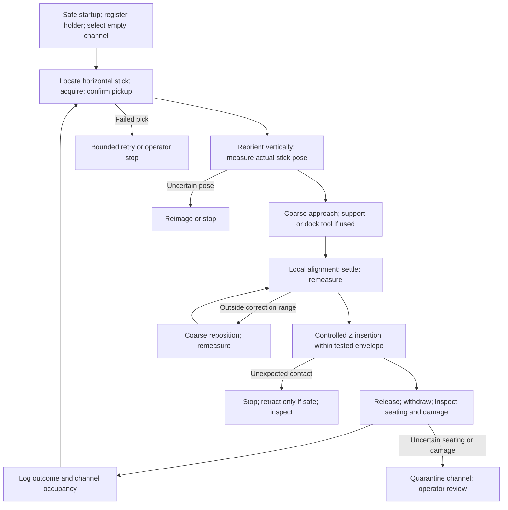

# TASK-001 — System Architecture & Process Flow

**Status: PROPOSED · Chief Engineer review required · 1 October 2026**

Context: [TASK-001](../tasks/Task-001.md), [project state](../../PROJECT_STATE.md), engineering constitution; GitHub revision `6ce3611`. No decisions are accepted by this review.

## Are we going down the right path?

**ENGINEERING JUDGMENT:** Yes to separating coarse transport from precision insertion, measuring pickup variation, and registering each replacement holder. The present implementation—two cameras, reconstructed transforms, and a robot-carried custom micropositioner—is plausible, but not yet justified. The critical problem is **damage-free coaxial insertion**, not simply accurate XY placement.

**Recommendation:** Characterize insertion and handling first. Test a **fixed local precision station**, preferably retaining the original grip through a supported/docked tool, against the current carried-stage concept. Do not select fine axes or promise 5 µm performance before measuring the capture envelope. Keep both architectures PROPOSED.

## Mission and goals

**SOURCE-BASED FACT — project briefing, not independently verified measurements:** Automatically pick horizontally presented nominal 500–510 µm square, approximately 12 mm long Bi₂Te₃ sticks, reorient them vertically, and insert them into nominal 530 µm square holder channels. Targets are ≤60 s pick-to-place, ≤3 ft × 6 ft footprint, swappable holders, and no functional damage. Hardware budget is $1,500; UR3e and shop access are available; completion is around December 2026.

| Goal / requirement | Proposed demonstration |
|---|---|
| Final system: REQ-SYS-001–004 | Automatic pick, reorient, align, insert, release and verify on real sticks; record cycle time, failures, damage and recovery |
| Swappable holders: REQ-SYS-006 | Replace holder and re-register successfully; automatic exchange is a separate scope question |
| Larger sticks: REQ-SYS-005 | Document and test relevant changes for up to 1 × 1 × 20 mm: tooling, optics, channel geometry, loads and travel |
| Alignment: REQ-SYS-007 | Derive XY and angular requirements from safe insertion tests; 5 µm remains an engineering target |
| Immediate development goal | One observable, controlled, repeatable insertion with representative holder and surrogates, followed by a limited real-part check |

**OPEN QUESTION:** Reconcile “no functional damage” with “<1 visibly damaged stick per 10 placements.” Visible cracks are unacceptable; a visible-damage count alone does not establish functional integrity. Define inspection, seating depth, success rate, trial count, and whether the 60 s target includes verification/retries before declaring success.

## Functional architecture

```text
HORIZONTAL PRESENTATION → ACQUIRE → REORIENT VERTICAL → COARSE TRANSPORT
                                                        │
                                                        ▼
                 FIXED LOCAL PRECISION INSERTION STATION [candidate]
                 ┌───────────────────────────────────────────────┐
                 │ Supported/docked tool retaining stick         │
                 │ Local optics → relative XY / yaw / tilt       │
                 │ Swappable holder → registered channel map     │
                 │ Minimum justified fine motion + controlled Z  │
                 └──────────────────────┬────────────────────────┘
                                        ▼
                         INSERT → RELEASE → VERIFY
                                        │
                              LOG / REJECT / RECOVER

Host state machine: coordinates robot, images, stage, pickup and inspection
Calibration: object-plane scale, camera geometry, tool/stick pose, holder map
Power & interfaces: lighting, actuator drivers, pickup feedback, cable routing
Risk-derived safety controls: robot/tool/pneumatic behavior, stop and restart
```

**ENGINEERING JUDGMENT:** The station is a candidate, not a requirement for a second gripper. Retaining the grip avoids a transfer but needs a dock that supports the tool without overconstraining the robot. Fine motion can act on the holder or tool; actual holder dimensions, occupied-channel clearance and stage travel decide which. Channel indexing travel and small alignment-correction travel are separate requirements.

| Subsystem / interface | What must be demonstrated |
|---|---|
| Presentation and pickup | Single accessible stick; low-damage retention and release; upstream sorting responsibility confirmed |
| Robot and tool | Horizontal-to-vertical reorientation without excessive slip or bending; delivery inside measured correction range |
| Holder fixture | Rigid support without distorting holder; measurable registration after swaps; local channel map accuracy |
| Optics and calibration | Actual stick/channel geometry observable, including necessary tilt; uncertainty over real heights and field positions |
| Fine alignment and insertion | Correct only demonstrated residual DOFs; bounded depth/contact behavior; no uncontrolled pushing |
| Sequencer and verification | Units, coordinate frames, timestamps, calibration version, validity and error status explicit; seated/intact outcome independently checked |

The ordinary host program must not serve as the sole protective stop system. Determine electrical and pneumatic behavior on power loss, including dropped sticks and retained vacuum, from the application risk assessment [S5].

## One operating cycle



**ENGINEERING JUDGMENT:** Measure after reorientation and again after docking if either changes the stick pose. Lost communications or calibration validity inhibit insertion. Contact failure must not trigger repeated blind pushing. Preserve occupancy and uncertain-cycle state through interruption so restart cannot insert into an occupied channel. Pressure/gripper feedback confirms only some pickup conditions, not intact single-stick acquisition or successful placement.

## Why XY accuracy alone is insufficient

**CALCULATION — ideal geometry, not a measured insertion tolerance:** Nominal 510 µm stick versus 530 µm opening gives 10 µm per side. For a straight rigid stick, zero yaw, uniform channel and entrance offset `e₀`, require approximately:

`max over z in [0,h] |e₀ + z tan(tilt)| ≤ 10 µm`

Here `h` is actual engaged channel depth, which is unknown. If the stick is centered at the entrance and `h = 12 mm`, tilt allowance is approximately 0.048°; with 5 µm offset in the adverse direction, approximately 0.024°. Optimally centering at mid-depth permits a 20 µm end-to-end axis displacement, twice the entrance-centered bound. Neither convention is a universal allowable angle. Straightness, burrs, taper, tolerances, friction, damage and measurement error reduce usable margins.

For pure yaw and zero lateral offset, `510 × (|cos ψ| + |sin ψ|) ≤ 530` gives roughly 2.29° near zero yaw. This is another ideal screening calculation, not a combined insertion acceptance test.

**ENGINEERING JUDGMENT:** XY, XYθz and XYZ mechanisms all leave pitch/roll uncorrected. Either mechanically constrain the axis, prove residual tilt fits the measured envelope, validate passive accommodation, or add measured angular correction. Adding Z does not solve tilt.

**SOURCE-BASED FACT:** UR3e lists ±0.03 mm pose repeatability and 3.5 N force-sensor accuracy [S1]. These do not establish micron placement accuracy or safe contact detection on brittle sticks. Repeatability describes repeated returns; accuracy concerns error relative to the reference; resolution is the smallest indicated increment; precision describes measurement spread.

**CALCULATION — illustrative optics:** A 1920-pixel field spanning 60 mm samples 31.25 µm/pixel; at 5 mm it samples 2.60 µm/pixel. Subpixel fitting is not proof of equivalent accuracy. Test calibrated error independently; calipers and repeated camera detections cannot establish the entire micron-scale error budget.

## Current concept versus alternatives

| PROPOSED candidate | Benefit / requirement served | Assumption, failure mode and verification |
|---|---|---|
| Current UR-carried fine tool + top/bottom vision | Keeps one grip; flexible holder access | Stable stick-to-tool transform, measured tilt, suitable stage range; test after rotation/travel under real cable loads |
| Fixed station with retained-grip docking | Coarse/fine split with stable local sensing; avoids handoff | Dock must not shift stick or fight robot; test tip pose before/after docking and access to occupied array |
| Fixed head; move holder XY and Z | Stable stick/optics; simpler moving precision assembly | Holder travel, collisions and registration may dominate; insert one stick, then test neighboring occupied channels |
| Passive guide/compliant tool | May replace angular actuation | Entrance must produce safe restoring forces; square edges may jam/chip; offset/angle/force sweep and guide-removal test |

**Transform challenge:** Reconstructing `holder→stick` from `world→holder`, `world→tool` and `tool→stick` is valid only when those are adequately observed spatial transforms and the last relationship remains stable. A common fiducial does not remove perspective bias, out-of-plane uncertainty or grip slip. A bottom-up end-face image plus a tool marker is not automatic proof of shaft pitch/roll. Test orthogonal side silhouettes or a qualified mechanical axis datum. Prefer local relative imaging when visibility permits; retain calibrated separate views if the tool occludes the channel [S2–S4].

## Concept Creative: challenge the framing

All concepts below are **ENGINEERING JUDGMENT / testable hypotheses**.

| Reframing / principle | What it could eliminate | Fastest useful kill test / downside |
|---|---|---|
| Hold stick stationary; raise holder around it | Precision motion on robot; changing gravity load | One insertion then neighboring occupied channels; collision and Z alignment can invalidate it |
| Load horizontal grooves; rotate a keyed cassette 90° | Individual regripping and uncertain reorientation | Rotate/release ten surrogates; groove tolerance, retention and brittle contact may defeat it |
| Removable tapered guide plate | Part of active alignment burden via passive geometry | Sweep offsets and remove guide after insertion; friction, chipping and trapped placed sticks may invalidate it |
| Three-stick comb/cassette matched to holder pitch | Repeated transport/vision through batch correspondence | Compare three-stick versus single insertion; pitch errors and simultaneous fracture forces may dominate |

Do not assume holder changes, new entrance chamfers or upstream cassette presentation are allowed. Obtain that constraint first. Batch insertion remains a later branch; validate single-stick mechanics before multiplying failure opportunities.

## Deliberation and preserved dissent

| Perspective | Independent concern | Cross-disciplinary outcome |
|---|---|---|
| Systems / TPM | Scope, budget and measurable outcome; station handoff may add dominant damage | Keep sorting/automatic holder exchange outside immediate work pending scope; preserve carried architecture |
| Mechanical | Long-stick tilt, grip deformation and sharp-entry jamming | Mechanical axis control first is preferred, but compliance requires a demonstrated safe capture mechanism |
| Electrical | Camera observability, calibration drift and unsuitable force sensing | Stationary local optical trial first; depth-camera availability does not establish sufficient uncertainty |
| Robotics software | Transform validity after rotation; uncorrected tilt; restart state | Post-rotation and post-dock checks; explicit bounded failure states |
| Concept Creative | Robot need not perform precision insertion; rearrange relative motion | Test moving-holder and cassette concepts; occupied-array access and release are veto risks |

**Meaningful dissent:** Station support may simplify precision mechanics but lose that benefit through docking constraints, handoff damage or restricted array access. Passive guides may remove expensive axes but introduce unacceptable contact. A carried stage remains credible if retained-grip handling wins. Compare both with the same holder, sticks, metrology and safe capture envelope; agreement among agents does not resolve this fork.

**Workflow record:** All five briefs/perspectives were used. Four specialist agent threads were available; the tool rejected the fifth thread. Robotics and Concept Creative therefore ran as separately labeled passes in one thread, before seeing other roles' results. This is weaker independence than five distinct agents. Mechanical and robotics then participated in cross-disciplinary critique; lead synthesis preserved the remaining forks. Claude is inactive under the updated AGENTS.md; no Claude proposal was read.

## Budget, milestones and invalidators

**ENGINEERING JUDGMENT:** $1,500 may support a reused/borrowed apparatus, but feasibility is unproven for several precision cameras, new force metrology and a custom multi-axis stage together. Reuse UR3e, host and shops; characterize with borrowed/manual adjustments. Motorization is still required for the final automatic system. Avoid designing a new parallel positioner before choosing necessary DOFs.

**ASSUMPTION — planning allocations, not prices or purchase approval:** Reserve $450 for optics/lighting/mounts, $300 for gripping/pneumatics, $350 for fine motion/contact limiting, $150 for fixtures/wiring, and $250 contingency: $1,500 total. Obtain quotes including shipping/tax and identify borrowed assets. If adequate metrology or motion cannot fit, request resources or revise scope explicitly; do not quietly weaken requirements. Include protective measures in the quoted cell budget or identify existing equipment that supplies them.

| Proposed gate | Timing assumption | Evidence to proceed |
|---|---|---|
| G1: characterize capture/handling | October | Measured geometry, safe force/depth envelope, actual-part check |
| G2: choose architecture and optics | Early November | Comparable carried/station trials; error budget; quoted feasible BOM |
| G3: automatic surrogate cycle | Late November | Full sequence, holder swap, cycle timing and injected-fault recovery |
| G4: real-part demonstration | December, exact PoP TBD | Agreed trial count, damage/functional inspection, repeatability, footprint and timing results |

These are work gates, not committed dates. Part availability, borrowed metrology and one human executor govern schedule.

**Critical invalidators:** (1) real channel depth/geometry makes tilt requirements unaffordable; (2) no grip/release method avoids real-part damage; (3) necessary pose is occluded or cannot be measured within uncertainty/budget; (4) guides/docking create worse contact or access problems; (5) calibration drift and cable forces consume the capture margin. Tin density matching and graphite tribology do not establish Bi₂Te₃ fracture, adhesion or functional integrity.

## Next five engineering tasks, in priority order

1. **Capture envelope and success definition.** Confirm holder depth/taper/pitch, stick geometry/straightness and required seating. Use optical metrology and controlled adjustments to map XY, yaw, pitch/roll, depth and force. Start with surrogates; cautiously validate safe points on real parts. Deliver an envelope with measurement uncertainty and agreed damage criteria.
2. **Pickup, rotation and release.** Compare compliant mechanical jaws and side-face vacuum using one grip through horizontal-to-vertical motion. Measure slip, deformation, release, double picks and real-part damage. Deliver a handling method or evidence that neither is viable.
3. **Optical observability proof.** Mock up real holder/tool heights, lighting, occlusion and field coverage. Compare local sensing with the top/bottom transform chain using independently known translations/tilts and holder swaps. Deliver an uncertainty budget covering bias, drift, grip motion and angle; do not RSS correlated biases away.
4. **Architecture discriminator.** Compare retained-grip station/docking or moving-holder arrangement with carried correction. Test repeated approach, neighboring occupied channels and safe insertion. Choose necessary correction DOFs/travel only when their measured residuals fit G1's envelope. Keep any unresolved branch visible to the Chief Engineer.
5. **Quoted minimum cell and integration gate.** Assemble BOM/resource/lead-time plan within $1,500 and a complete state sequence. Demonstrate injected failed pick, lost image, stage-range error, unexpected contact and interrupted-cycle restart; then conduct surrogate and real-part runs against agreed criteria.

## Evidence and architectural precedent

Sources checked 1 October 2026. None proves this project's insertion capability.

- **[S1] Manufacturer:** [UR3e technical specifications](https://www.universal-robots.com/manuals/EN/HTML/SW10_6/Content/prod-usr-man/hardware/arm_e-Series/UR3e/H_g5_sections/appendix_g5/tech_spec_data.htm). Repeatability and force accuracy are distinct specifications, not a brittle-stick insertion guarantee.
- **[S2] Peer-reviewed:** Hutchinson, Hager & Corke, *A Tutorial on Visual Servo Control*, IEEE Transactions on Robotics and Automation 12(5), 651–670 (1996), [author-hosted paper](https://faculty.cc.gatech.edu/~seth/ResPages/pdfs/HutHagCor96.pdf), DOI 10.1109/70.538972. Visual feedback/control precedent; no claim of applicable 5 µm performance.
- **[S3] Established assembly software:** [OpenPnP Bottom Vision](https://github.com/openpnp/openpnp/wiki/Bottom-Vision). Pickup-offset compensation and pre-rotation precedent. [Opulo design guidance](https://docs.opulo.io/guides/design-for-lumenpnp/) describes PCB-oriented component handling/fiducials; LumenPnP availability does not establish vertical reorientation or narrow-channel insertion suitability.
- **[S4] Manufacturer:** [Basler telecentric optics](https://www.baslerweb.com/en-us/lenses/telecentric-lenses/). Perspective-reduction principle; telecentric optics neither remove all errors nor establish budget fit.
- **[S5] Manufacturer:** [UR application risk assessment](https://www.universal-robots.com/manuals/EN/HTML/SW10_7/Content/prod-usr-man/complianceUR5e/H_g5_sections/safety_g5/risk_assessment.htm). Application/tool/workpiece safeguards remain integration responsibilities; cited manual is an architecture example, not this cell's completed assessment.
- **[S6] Authoritative technical report:** Shneier et al., *Measuring and Representing the Performance of Manufacturing Assembly Robots*, NISTIR 8090 (2015), [report](https://nvlpubs.nist.gov/nistpubs/ir/2015/NIST.IR.8090.pdf), DOI 10.6028/NIST.IR.8090. Task-specific evaluation supports measuring insertion outcomes rather than selecting on robot specifications alone.
- **[S7] Peer-reviewed literature identified, abstract-level use only:** Whitney, *Quasi-Static Assembly of Compliantly Supported Rigid Parts*, ASME Journal of Dynamic Systems, Measurement, and Control 104(1), 65–77 (1982), [DOI](https://doi.org/10.1115/1.3149634). Bibliography/abstract verified; full-text retrieval failed. Compliance is relevant precedent, not demonstrated safe behavior for fragile square sticks. No numerical damage limits are imported from it.

**Confidence:** High in the need for local alignment, angular assessment, damage-limited insertion and outcome verification; moderate in the fixed-station preference; low in selected DOFs, optical capability, safe forces and budget sufficiency until experiments.
